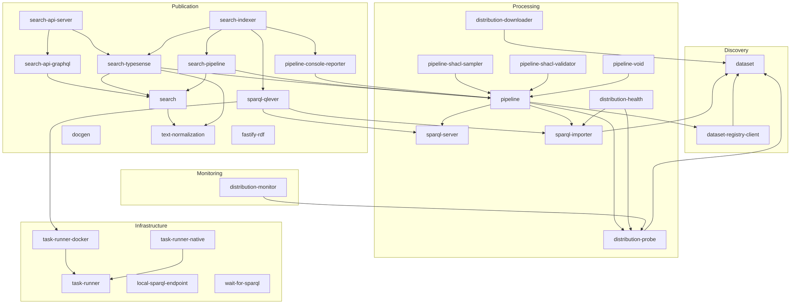

# Architecture

Where [core concepts](./core-concepts) explains how a pipeline run works, this page maps the codebase: LDE is organized as a set of small packages, grouped by the phase of the Linked Data lifecycle they serve. Packages in higher layers depend on lower ones, never the other way around.

## Lifecycle phases

**Discovery** finds the data. [@lde/dataset](../reference/dataset) defines the core `Dataset` and `Distribution` objects; [@lde/dataset-registry-client](../reference/dataset-registry-client) retrieves dataset descriptions from DCAT-AP 3.0 registries.

**Processing** transforms the data. [@lde/pipeline](../reference/pipeline) is the centre of gravity: it selects datasets (via the registry client or manually), resolves each dataset to a usable SPARQL endpoint (probing the dataset’s own endpoint, or importing a data dump into a local server via [@lde/sparql-importer](../reference/sparql-importer)), and runs SPARQL transformation stages against it. Plugin packages extend the pipeline: [@lde/pipeline-void](../reference/pipeline-void) for VoID statistics, [@lde/pipeline-shacl-validator](../reference/pipeline-shacl-validator) for validation, [@lde/pipeline-shacl-sampler](../reference/pipeline-shacl-sampler) for per-class sampling. The `distribution-*` packages probe, download and health-check distributions.

**Publication** serves the results. [@lde/fastify-rdf](../reference/fastify-rdf) adds RDF content negotiation to Fastify, and [@lde/docgen](../reference/docgen) generates documentation from SHACL shapes. The `search-*` packages form a sub-system of their own: [@lde/search](../reference/search) projects RDF into engine-agnostic search documents, [@lde/search-pipeline](../reference/search-pipeline) applies that projection inside a pipeline run, [@lde/search-typesense](../reference/search-typesense) writes the documents to Typesense, and [@lde/search-api-graphql](../reference/search-api-graphql) plus [@lde/search-api-server](../reference/search-api-server) serve them over GraphQL. [@lde/search-indexer](../reference/search-indexer) packages the indexing side as a config-driven Docker image.

**Monitoring** observes the system: [@lde/distribution-monitor](../reference/distribution-monitor) probes DCAT distributions periodically, and [@lde/pipeline-console-reporter](../reference/pipeline-console-reporter) reports pipeline progress to the console.

**Infrastructure** underpins the rest: [@lde/sparql-server](../reference/sparql-server) starts, stops and controls SPARQL servers, with [@lde/sparql-qlever](../reference/sparql-qlever) as the QLever adapter running on the [@lde/task-runner](../reference/task-runner) abstraction (Docker or native). [@lde/local-sparql-endpoint](../reference/local-sparql-endpoint) spins up throwaway endpoints for tests, and [@lde/wait-for-sparql](../reference/wait-for-sparql) waits for an endpoint to come up.

## Package dependencies

## Key decisions

The design is documented as architecture decision records – see the **Decisions** section under [Reference](../reference/). Good starting points:

- [ADR 1 – Merge pipeline approaches](../decisions/0001-merge-pipeline-approaches): how the pipeline model came to be.
- [ADR 2 – Unify pipeline extension on quad transforms](../decisions/0002-unify-pipeline-extension-on-quad-transforms): the single extension mechanism.
- [ADR 12 – Bound memory by the unit of work, not the input](../decisions/0012-bound-memory-by-the-unit-of-work-not-the-input): the memory model that runs through everything.
