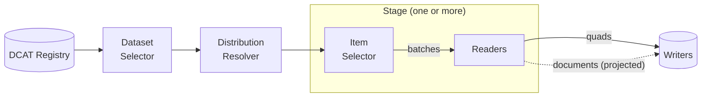

# Core concepts

Six concepts recur throughout LDE. Each maps to an interface you can replace.

## Dataset and distribution

A **dataset** is the unit of processing: an IRI plus metadata, described in [DCAT](https://www.w3.org/TR/vocab-dcat-3/) terms. A **distribution** is a concrete way to get at its data – a SPARQL endpoint or a downloadable dump. One dataset can offer several distributions; LDE picks the usable one at run time. Defined in [@lde/dataset](../reference/dataset).

## Pipeline

A **pipeline** processes a stream of datasets: select, resolve, transform, write. It never holds a dataset in memory – data flows through in batches, so memory is bounded by configuration (`batchSize`, `maxConcurrency`), not by input size ([ADR 12](../decisions/0012-bound-memory-by-the-unit-of-work-not-the-input)). Defined in [@lde/pipeline](../reference/pipeline).

The **dataset selector** decides which datasets to process: a manual list, or a query against a DCAT registry ([select datasets from a registry](./select-datasets-from-a-registry)).

The **distribution resolver** turns each dataset into something queryable. By default it probes the dataset’s own SPARQL endpoint; wrapped in an `ImportResolver`, it can fall back to [importing a data dump](./import-data-dumps) into a local server.

## Stage

A **stage** is one transformation step, defined by SPARQL:

- The **item selector** runs a SELECT query that yields bindings – classes, resources, whatever the query projects – in batches.
- Each batch fans out to one or more **readers**: CONSTRUCT queries that receive the batch as a `VALUES` clause and generate triples.

This selector-and-fan-out shape is how LDE transforms datasets far larger than memory: no reader ever sees more than one batch. A stage without an item selector runs its readers once, globally.

## Writer

A **writer** streams the generated output to a destination – a SPARQL endpoint via UPDATE, or local files. Writers are transactional: a run ends in exactly one `commit` or `abort`, so destinations can implement atomic swaps and safe cleanup.

A pipeline is generic over what it writes: RDF quads by default, or documents – [@lde/search-pipeline](../reference/search-pipeline) projects each batch into flat search documents before they reach the writer ([ADR 13](../decisions/0013-project-inside-the-batch-per-root-type)), which is how the same pipeline machinery feeds a search engine.

## Extension points

TypeScript enters only where SPARQL cannot express the logic:

- A [**quad transform**](./extend-a-stage-with-a-quad-transform) post-processes one reader’s output.
- A **plugin** hooks into the write path across stages or datasets – provenance stamping, namespace rewriting ([plugins](../reference/pipeline#plugins)).
- A **reporter** observes lifecycle events for progress display or metrics.
- A [**validator**](./validate-pipeline-output) checks each batch before it is written.

## Where the packages fit

The [architecture page](./architecture) maps all packages onto the lifecycle; the [packages reference](../reference/packages) lists them individually.
